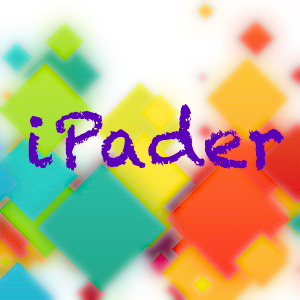

iPader
===
## 关于
 
此站是ideaTouch公司下属技术交流帐号。技术涉足领域包括：产品开发，HTML5/JS，Swift语言，iOS/Android产品及应用，开源实验性项目。

* [@iPader](http://weibo.com/ipader)：自有产品《读了吗》及衍生产品微博
* [@JSLab](http://weibo.com/jslab)：HTML5/JS技术及开源项目分享微博
* [@SwiftLanguage](http://weibo.com/swiftlanguage)：Swift语言技术及开源项目分享微博

## 项目
1. [读了吗](http://dulema.com): 它是一款跨媒体网络图书馆应用。为主流文档（PDF, Word, PPT, ePub, Text, UMD, Google Books, RSS, HTML）提供统一的管理、阅读体验！
2. [读了吗·稍后](http://m.dulema.com): 它是《读了吗》轻版应用，也是一款加强版“稍后阅读”。缺省附带的浏览器扩展应用加速访问效率。为博客、订阅、文章、网页提供电子书式阅读体验，以及排版精美的长微博制作、分享功能。

## 分享
1. [Swift语言指南](http://dev.swiftguide.cn) ([持续更新中...](https://github.com/ipader/SwiftGuide))
2. [HTML5应用介绍](http://wenku.baidu.com/view/eb4f15dbad51f01dc281f129.html) (2010/11/1)

## 文章
1. [Google Glass: 未来不遥远](blog/chapter-1.xhtml) (2013-2-21)
2. [Apple：如此相得益彰](blog/chapter-18.xhtml) (2010-4-19)
3. [iPad：改变我们的生活习惯](blog/chapter-17.xhtml) (2010-3-27)
4. [iPad：谁为您的利益负责？](blog/chapter-16.xhtml) (2010-3-19)
5. [UED：Web应用我所见](blog/chapter-15.xhtml) (2010-3-14)
6. [iPad：实用来自云端](blog/chapter-14.xhtml) (2010-3-10)
7. [iPad：人机界面2.0](blog/chapter-13.xhtml) (2010-3-8)
8. [iPad：谁的奶酪？](blog/chapter-12.xhtml) (2010-3-3)
9. [iPad：触控的魅力](blog/chapter-11.xhtml) (2010-3-1)
10. [iPad：历史的车轮](blog/chapter-10.xhtml) (2010-2-22)
11. [iPad：如何捧着工作](blog/chapter-9.xhtml) (2010-2-19)
12. [iPad：最后的战场](blog/chapter-8.xhtml) (2010-2-11)
13. [iPad：原生应用还是Web应用？](blog/chapter-7.xhtml) (2010-2-5)
14. [iPad：企业应用前景展望（三）](blog/chapter-6.xhtml) (2010-2-4)
15. [iPad：企业应用前景展望（二）](blog/chapter-5.xhtml) (2010-2-2)
16. [iPad：企业应用前景展望（一）](blog/chapter-4.xhtml) (2010-2-2)
17. [iPad：更真切地的认识它](blog/chapter-3.xhtml) (2010-1-31)
18. [iPad：回归理性的最佳设计](blog/chapter-2.xhtml) (2010-1-28)
